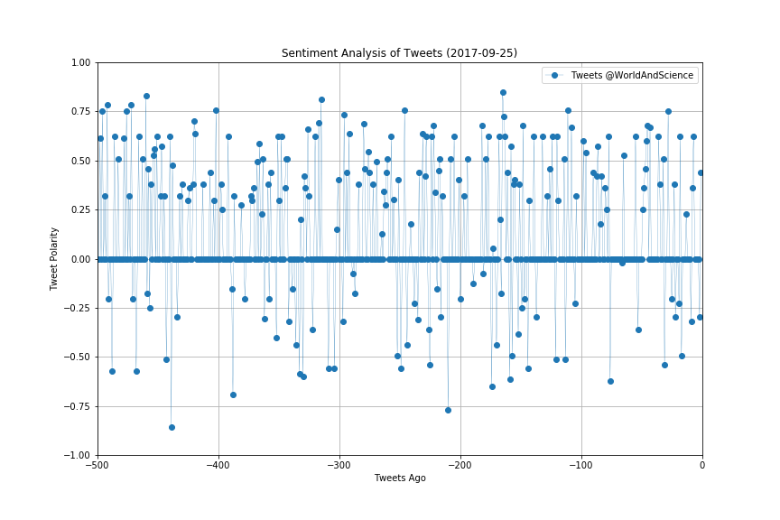

## PlotBot


- I built a Twitter bot that sends out visualized sentiment analysis of a Twitter account's recent tweets.
The bot receives tweets via mentions and in turn performs sentiment analysis on the most recent twitter account specified in the mention. For example, when a user tweets, "@PlotBot Analyze: @CNN," it will trigger a sentiment analysis on the CNN twitter feed. A plot from the sentiment analysis is then tweeted to the PlotBot5 twitter feed.
  
- Technologies: Matplotlib, Pandas, Tweepy, Seaborn,and Sentiment Analysis


```python

```
